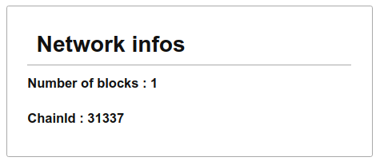

## Local Node Info

### Instructions

Create a web page, `localNodeInfo.html` that loads an ethereum library, connects to a local node (at `http://localhost:8545`) and displays basic information : 
- In an element with `chainId` as `id`, the number ID of the current network 
- In an element with `blockNumber` as `id` the number of blocks in the chain
You can use any library such as ethers.js or web3.js to connect to your local node

### Resources

- [ethers provider](https://docs.ethers.io/v5/api/providers/provider/#Provider--transaction-methods](https://docs.ethers.io/v5/api/providers/provider/#Provider--network-methods))
- [web3](https://web3js.readthedocs.io/en/v1.3.4/web3-eth.html)

### Relevance

Network information
Libraries in the browser
